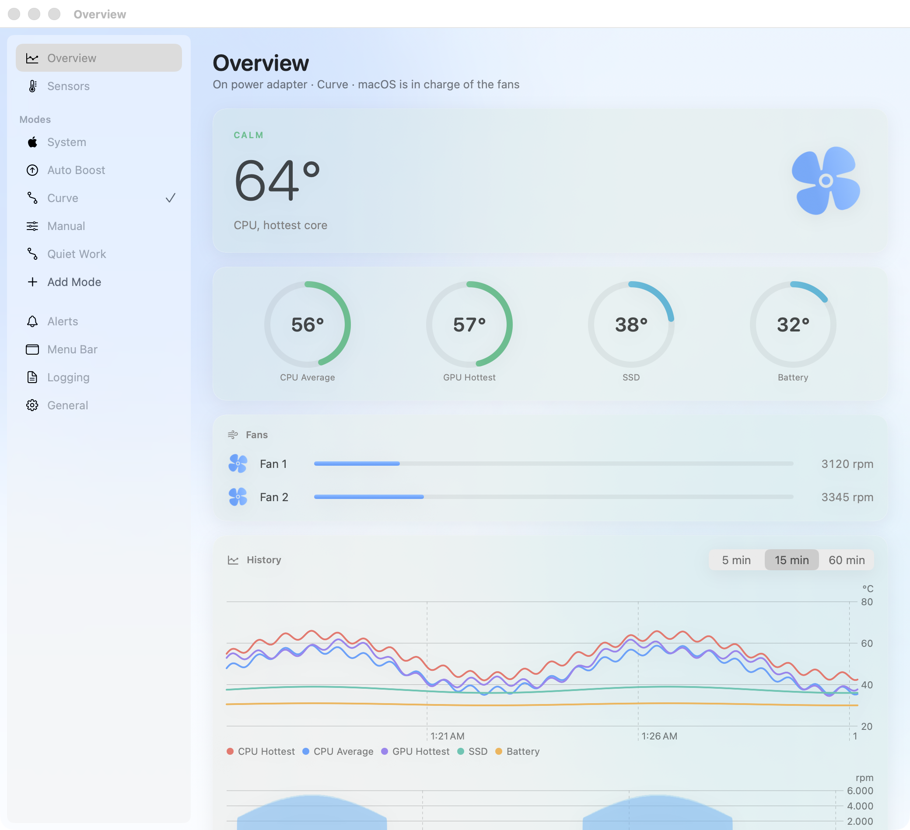
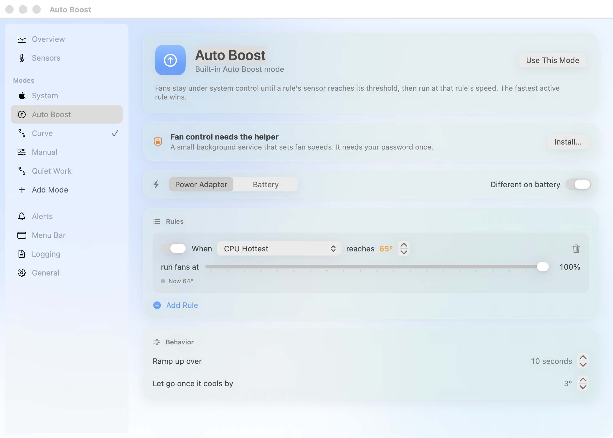
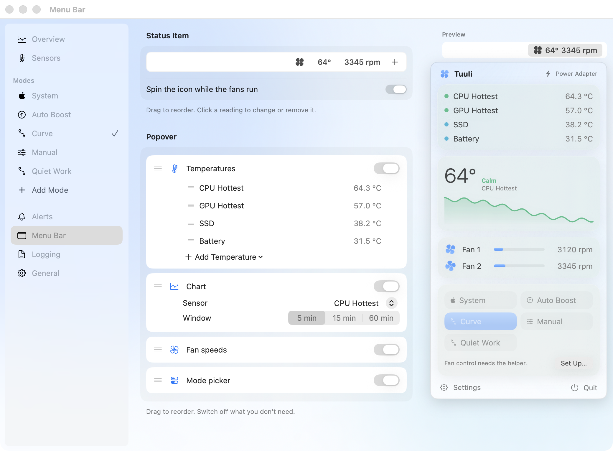
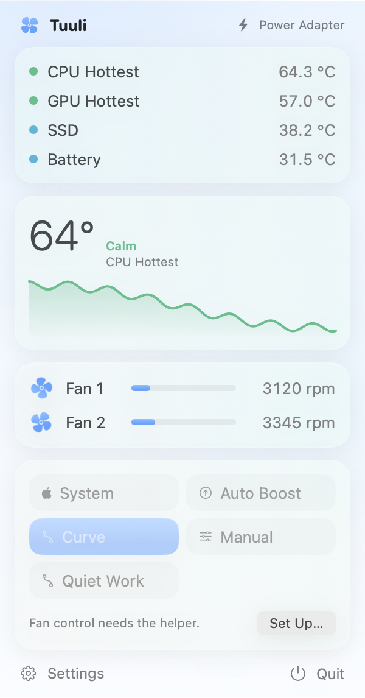
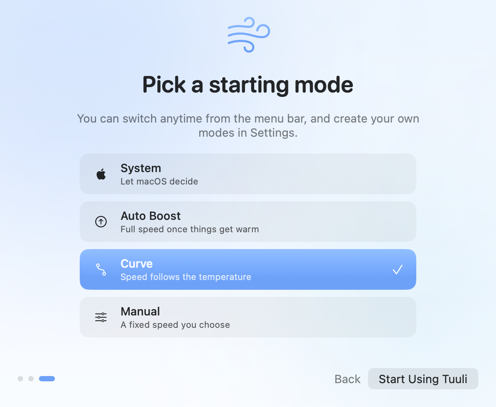
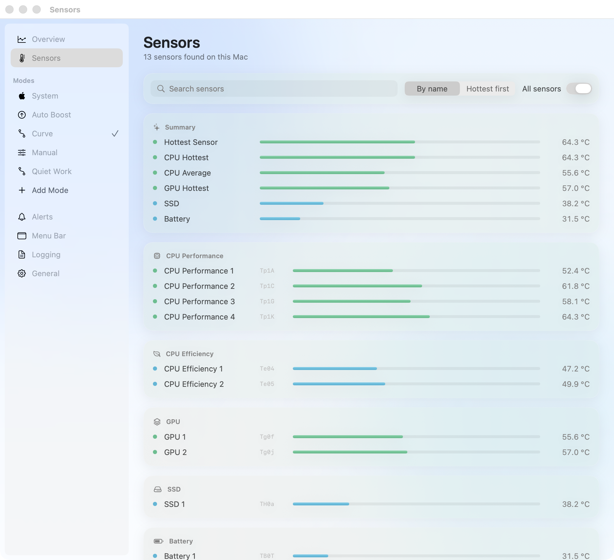

<div align="center">


# Tuuli

**Temperatures in the menu bar and fan control for Apple Silicon Macs. Free and open source.**

[](#install)
[](Package.swift)
[](https://www.gnu.org/licenses/gpl-3.0.html)

<picture>
  <source media="(prefers-color-scheme: dark)" srcset="docs/screenshots/overview-dark.png">
  
</picture>

</div>

## Why

- MacBook Pros let the chip run hot before the fans spin up. Tuuli lets you start cooling earlier, on your own terms.
- Tuuli ("wind" in Finnish) is a small native menu bar app, with no account and no subscription.

## Features

- **Sensors**: discovered at runtime from the SMC and grouped into CPU performance, CPU efficiency, GPU, SSD, battery, wireless, ambient and surface. Summary values (hottest sensor, CPU hottest, CPU average, GPU, SSD, battery) work the same on every Apple Silicon Mac.
- **Fan modes**, picked from the menu bar or the settings sidebar:
  - **System**: macOS stays in control, Tuuli only monitors.
  - **Auto Boost**: rules like "when CPU Hottest reaches 65 °C, run fans at 100%". The fastest active rule wins, with a configurable ramp time and release hysteresis.
  - **Curve**: a temperature-to-speed curve on any sensor. 0% hands control back to macOS so fans can still idle.
  - **Manual**: a fixed speed, adjustable with a slider right in the menu bar popover.
  - **Custom modes**: create, name and duplicate your own Boost, Curve or Manual modes. The built-in modes can be renamed but not deleted.
- **Power source**: Boost and Curve modes can use different settings on battery and on the power adapter, switched automatically.
- **Menu bar**: the status item shows any mix of icon, temperatures and fan speed, in the order you choose.
- **Popover**: temperatures, a mini chart, fan speeds and the mode picker, each one optional and in the order you choose.
- **History**: temperature and fan speed charts over the last 5, 15 or 60 minutes.
- **Alerts**: notifications when a sensor crosses a threshold, with a repeat cooldown.
- **CSV logging**: every sensor and fan, at a chosen interval, one file per day.
- **Design**: an airy, frosted look where color only ever means heat, fans that spin at their real pace, a draggable fan curve, and a short welcome on first launch.
- **Menu bar icon**: the fan turns while the fans run, faster as they speed up. It can be switched off.
- **Fail-safe**: the fans go back to macOS when Tuuli quits or crashes, when it stops responding for 10 seconds, when the Mac goes to sleep, and when the helper is stopped.

## Screenshots

<picture>
  <source media="(prefers-color-scheme: dark)" srcset="docs/screenshots/mode-dark.png">
  
</picture>
<p align="center"><sub>Modes</sub></p>

<picture>
  <source media="(prefers-color-scheme: dark)" srcset="docs/screenshots/menu-bar-dark.png">
  
</picture>
<p align="center"><sub>Menu bar and popover</sub></p>

<p align="center">
  <picture>
    <source media="(prefers-color-scheme: dark)" srcset="docs/screenshots/popover-dark.png">
    
  </picture>
  &nbsp;&nbsp;
  <picture>
    <source media="(prefers-color-scheme: dark)" srcset="docs/screenshots/onboarding-3-dark.png">
    
  </picture>
</p>
<p align="center"><sub>Popover and first launch</sub></p>

<picture>
  <source media="(prefers-color-scheme: dark)" srcset="docs/screenshots/sensors-dark.png">
  
</picture>
<p align="center"><sub>Sensors</sub></p>

## Requirements

- An Apple Silicon Mac with macOS 26 or later.
- An administrator password, once, to install the fan control helper. Monitoring works without it.

## Install

1. Download the latest `Tuuli-<version>.dmg` from Releases and drag the app to Applications.
2. Tuuli is signed with a local Apple Development identity and not notarized, so Gatekeeper blocks the first launch:
   - Open the app once, then go to **System Settings > Privacy & Security** and click **Open Anyway**.
   - Or remove the quarantine flag from Terminal: `xattr -dr com.apple.quarantine /Applications/Tuuli.app`
3. Launch Tuuli. A short welcome walks you through the helper and a starting mode.
4. To control fans, open **General** and click **Install Helper…**, then enter your administrator password.

## How fan control works

- Reading temperatures and fan speeds needs no special rights. Writing fan speeds needs root.
- **Install Helper…** copies a small daemon to `/Library/PrivilegedHelperTools/com.gabrielepartiti.tuuli.helper` and registers it in `/Library/LaunchDaemons`.
- The helper only accepts XPC connections from Tuuli signed by the same team, and only sets fan speeds or hands them back to macOS. Every decision is made in the app.
- The app refreshes the target speed on every update. If it stops doing so for 10 seconds, the helper restores automatic control.

## Settings location

- Settings and modes are stored as JSON at `~/Library/Application Support/Tuuli/settings.json`.
- CSV logs go to `~/Documents` by default, as `Tuuli-<date>.csv`.

## Build from source

Requires Xcode (or the Command Line Tools) with Swift 6.2.

```sh
./scripts/build.sh      # build/Tuuli.app
open build/Tuuli.app
./scripts/make-dmg.sh   # build/Tuuli-<version>.dmg
swift test              # core tests
```

- `build.sh` builds the app and the helper with Swift Package Manager, assembles `build/Tuuli.app` and signs both with the same identity. Set `TUULI_SIGN_IDENTITY` to use your own.
- `make-dmg.sh` builds the app first if needed (pass `--rebuild` to force a fresh build), then packages it with `hdiutil`.
- After rebuilding, click **Update Helper…** if the helper version changed.

## Uninstall

- In **General**, click **Uninstall Helper…** to hand the fans back to macOS and remove the daemon.
- Quit Tuuli and remove it from `/Applications`.
- Delete `~/Library/Application Support/Tuuli` to also clear its settings.

## Privacy

- Settings and logs stay on your Mac.
- No network access, no analytics, no account, no server.

## Notes

- SMC key names differ between chips, so sensors are named by category and number (for example "CPU Performance 3"). The raw key is shown next to each one.
- Keys whose values are not temperatures, or that read outside 10–130 °C when Tuuli starts, are skipped.
- Fan speeds apply to all fans together, as a percentage of each fan's own range.

## License

Copyright (C) 2026 Gabriele Partiti

Tuuli is free software, released under the [GNU General Public License v3.0](https://www.gnu.org/licenses/gpl-3.0.html).
