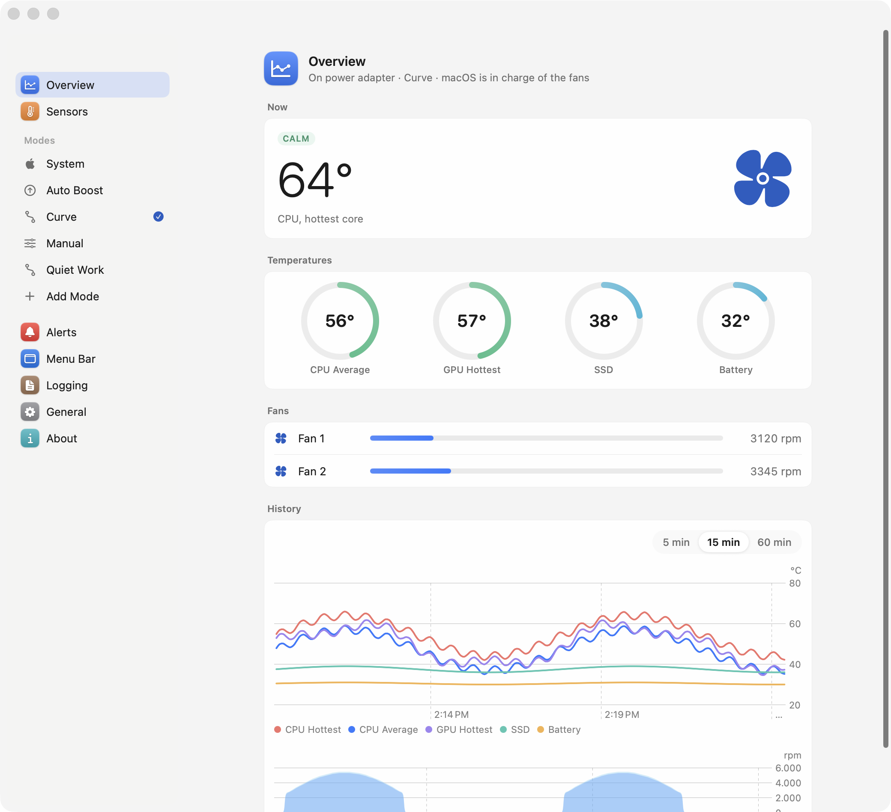
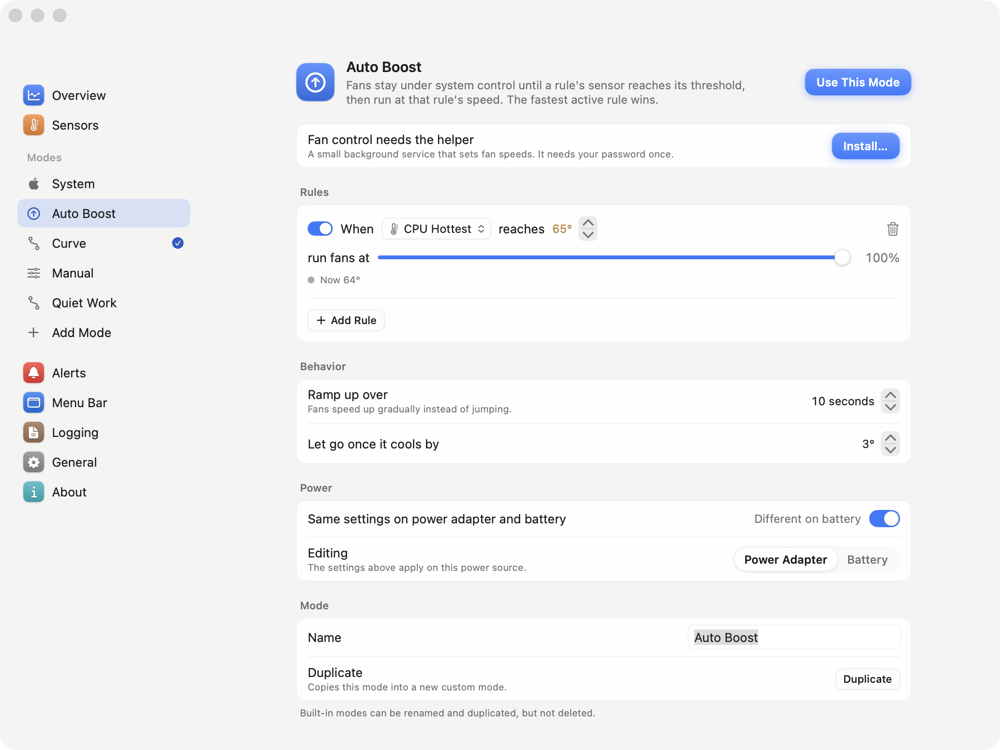
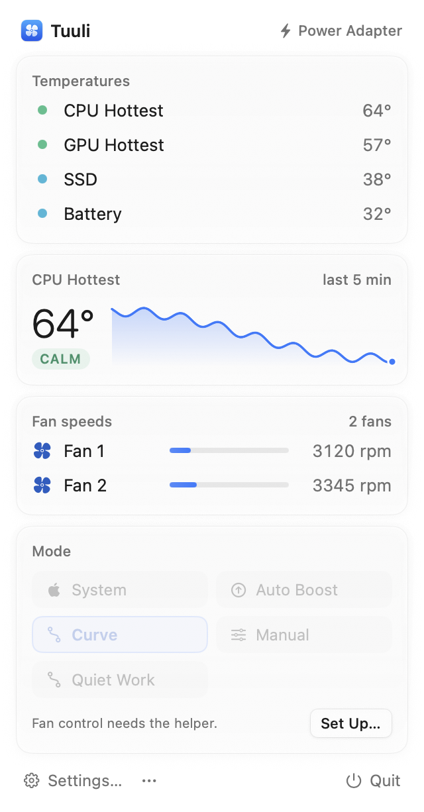

<div align="center">


# Tuuli

**Temperatures in the menu bar and fan control for your Mac. Free and open source.**

[](#install)
[](Package.swift)
[](https://www.gnu.org/licenses/gpl-3.0.html)
[](https://github.com/gabry-ts/tuuli/releases)

<picture>
  <source media="(prefers-color-scheme: dark)" srcset="docs/screenshots/overview-dark.png">
  
</picture>

</div>

## Features

- **Sensors**: found automatically on any Apple Silicon Mac, with CPU, GPU, SSD and battery summaries.
- **Fan modes**: System, Auto Boost rules, a draggable Curve and Manual, plus your own named modes, with separate settings on battery.
- **Menu bar**: pick and order the readings, and a popover with a mode picker and manual speed slider.
- **History, alerts and CSV logging.**
- **Fail-safe**: fans go back to macOS when Tuuli quits, crashes, stops responding or the Mac sleeps.
- **Automatic updates**: signed, notarized updates through Sparkle, with a Check for Updates… button in the menu bar popover and in Settings.

<p align="center">
  <picture>
    <source media="(prefers-color-scheme: dark)" srcset="docs/screenshots/mode-dark.png">
    
  </picture>
  &nbsp;
  <picture>
    <source media="(prefers-color-scheme: dark)" srcset="docs/screenshots/popover-dark.png">
    
  </picture>
</p>

## Requirements

- A Mac with macOS 26 or later. Tuuli is a universal app: it's built and tested on Apple Silicon, and support for Intel Macs is experimental and untested on real hardware.
- An administrator password, once, to install the fan control helper. Monitoring works without it.

## Install

With [Homebrew](https://brew.sh):

```sh
brew install --cask gabry-ts/tap/tuuli
```

Or download the latest `Tuuli-<version>.dmg` from [Releases](https://github.com/gabry-ts/tuuli/releases) and drag the app to Applications. Tuuli is signed with a Developer ID and notarized by Apple, so it opens without any Gatekeeper workaround. A short welcome walks you through the fan control helper and a starting mode.

Tuuli keeps itself up to date. On the second launch it asks whether to check for updates automatically; you can change that later in **Settings > General**.

Upgrading from 0.1.x: those versions have no updater, so download 1.0.0 once by hand. Tuuli then offers to update the fan control helper, which asks for your password once.

## How fan control works

- Writing fan speeds needs root, so **Install Helper…** adds a small daemon under `/Library/PrivilegedHelperTools` and `/Library/LaunchDaemons`.
- It only accepts Tuuli signed by the same team, only sets fan speeds, and hands them back to macOS if the app goes quiet for 10 seconds.
- When an update needs a newer helper, or the installed one was signed by a different team, Tuuli offers **Update Helper…** on launch and in **General**.
- Settings live in `~/Library/Application Support/Tuuli/settings.json`. No analytics, no account.

## Build from source

Requires Xcode (or the Command Line Tools) with Swift 6.2.

```sh
./scripts/build.sh      # build/Tuuli.app
open build/Tuuli.app
./scripts/make-dmg.sh   # build/Tuuli-<version>.dmg, laid out by create-dmg if installed
swift test              # core tests
```

The build is universal (arm64 and x86_64) and signs with `Developer ID Application` by default. Set `TUULI_SIGN_IDENTITY` to another identity, or to `-` for a local ad hoc build. Releases are built, notarized and published by `scripts/release.sh` from the GitHub Actions workflow when a `v*` tag is pushed.

## Uninstall

In **General**, click **Uninstall Helper…**, then quit Tuuli and remove it from `/Applications`. Delete `~/Library/Application Support/Tuuli` to also clear its settings.

## Privacy

- Settings and logs stay on your Mac.
- The only network access is the update check, which fetches the release feed from GitHub. You can turn automatic checks off in **General**.
- No analytics, no account, no server.

## Support

Tuuli is free. If it keeps your Mac cool, you can [buy me a coffee](https://buymeacoffee.com/gabrielepartiti).

## License

Copyright (C) 2026 Gabriele Partiti

Tuuli is free software, released under the [GNU General Public License v3.0](https://www.gnu.org/licenses/gpl-3.0.html).
